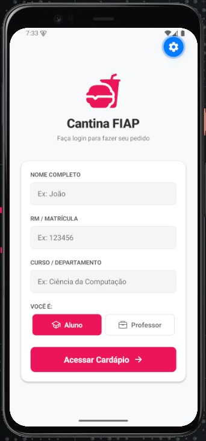
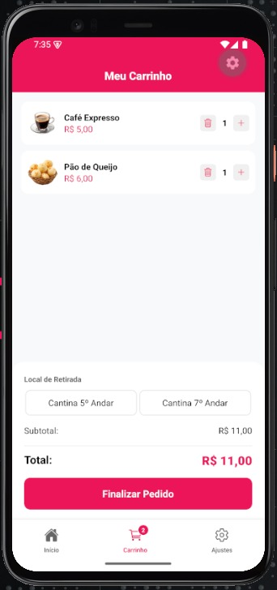
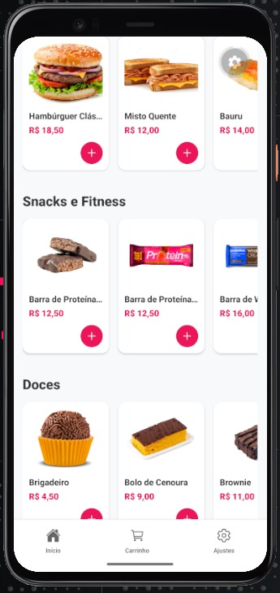
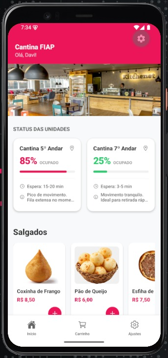
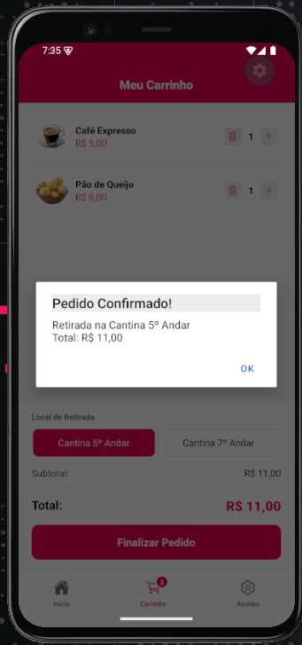
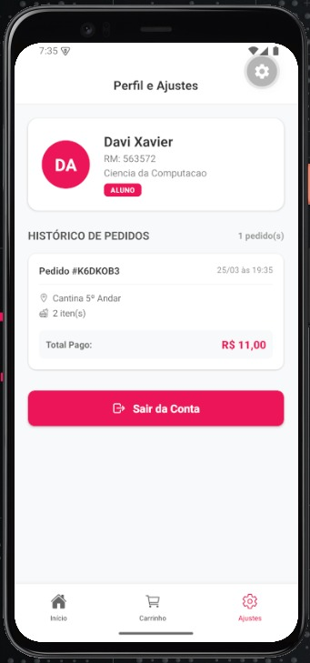

# 🍔 Cantina FIAP - Refectory App (CP1)

## 🎥 Demonstração

<p align="center">
  
</p>

> *Adicione aqui um GIF curto mostrando o fluxo principal do app (login → pedido → confirmação).*

---

## 📱 Telas do Aplicativo

<p align="center">
  
  
  
</p>

<p align="center">
  
  
  
</p>

---

## 🚀 Funcionalidades Implementadas

- **Navegação Moderna:** Utilização do `Expo Router` com proteção de rotas (redirecionamento automático se o usuário não estiver logado).
- **Gerenciamento de Estado Global:** Uso da `Context API` para manter os dados do usuário, carrinho e histórico sincronizados.
- **Persistência de Dados:** Implementação do `Async Storage` para salvar sessão e histórico de compras.
- **Regra de Negócio:** Aplicação automática de **10% de desconto** para usuários com perfil "Professor".
- **UX/UI Interativa:**
  - Simulação de ocupação em tempo real das cantinas
  - Alertas nativos e Toasts
  - Listas otimizadas com `FlatList`

---

## 🛠️ Tecnologias Utilizadas

- React Native (SDK 55)
- Expo & Expo Router
- Context API (useContext, useState, useEffect)
- Async Storage
- Expo Vector Icons (Ionicons)

---

## 💻 Como Executar o Projeto

1. Clone o repositório:
   ```bash
   git clone <URL_DO_REPOSITORIO>